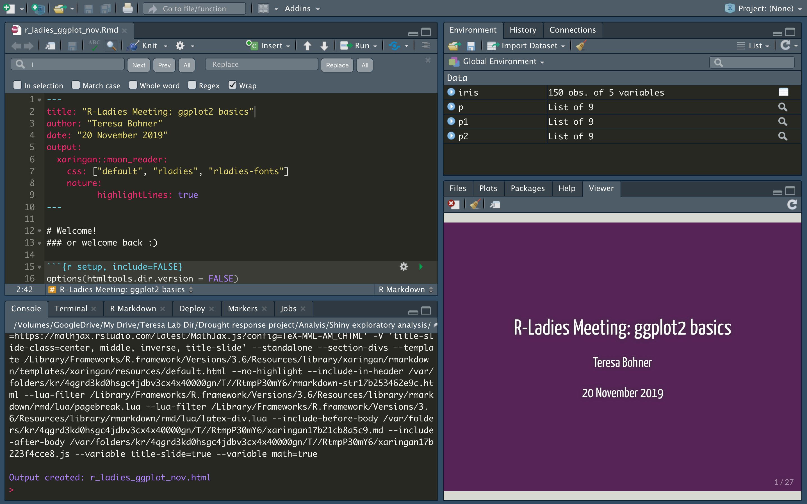
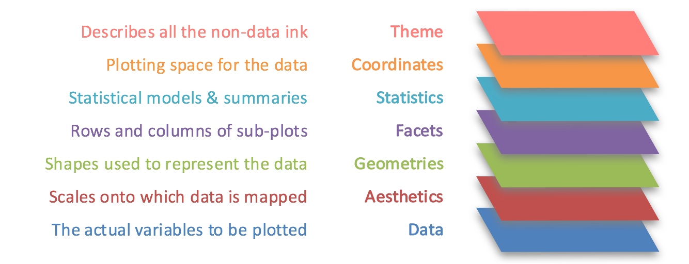
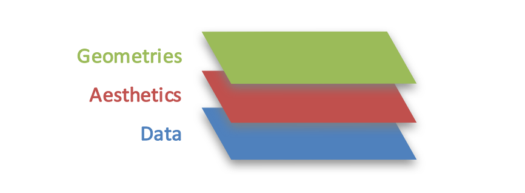
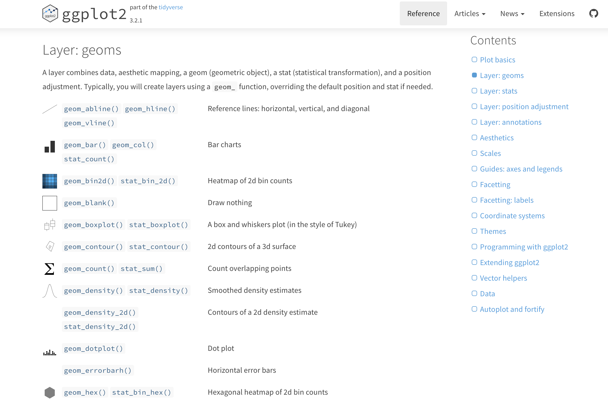

# Welcome!
### or welcome back :)

```{r setup, include=FALSE}
options(htmltools.dir.version = FALSE)
knitr::opts_chunk$set(fig.retina=3)
library(ggplot2)
data(iris)

```

<!--
- Compile from command-line
Rscript -e "knitr::knit('r_ladies_ggplot_nov.Rmd', tangle=TRUE)"
-->

```{r, echo=FALSE}
knitr::include_graphics("logo.png")
```


---
class: inverse, center
background-image: url(https://media.giphy.com/media/HkEAY1Yu8UWLS/giphy.gif) 
# Let's Get Started
### R basics crash course


---
# R Basics
R is a powerful language. In RStudio we have a nice view of our **scripts**, the **console**, and the **global environment**. Scripts are for us to keep track of what we do, the console is a real-time record of the processes that we have ran and the global environment contains all of our **objects**

```{r, echo=FALSE, out.height='50%', out.width="70%"}

```


---
# R Basics
### Objects and Classes

An **object** is simply a data structure.  A **class** is sort of like a blueprint for any object. 

--

### Data Types
- numeric
- **"**character**"**
- logical
- factor

--
- vector
- matrix 
- array 
- list
- data frame (or tibble if you're in the **tidyverse**)

---
# R Basics
### Functions and Help Files
If objects are like the nouns of the R language, functions are like the verbs. Functions are always used like:

```{r, eval=F}
function(argument1 = value1, argument2 = value2)
```
######*Note that you can nest functions (we'll talk about this later)

Although you can always build your own, there are already many functions among all of the numerous R packages. R documentation can help you learn how to use them.

```{r, eval=F}
?merge
```
[help link](https://www.rdocumentation.org/packages/base/versions/3.6.1/topics/merge)


---
# R Basics
### Key Functions and Operations
```{r, eval=F}
#  use hashtags to annotate your code
object_name <- c(1:9)
object_mat <- matrix(object_name, 3, 3)
object_mat[1, 3]
some_data <- data(iris)
iris$Sepal.Length

str(iris)
class(iris)

ls()
rm()
```
### You can make tons of different plots with R base package but to avoid confusion...

---
class: inverse

background-image: url("https://media.giphy.com/media/JIX9t2j0ZTN9S/giphy.gif")
background-position: right

# On to ggplot2!
--

.pull-left[
#### don't forget to install and load the package!
```{r, eval=FALSE}
install.packages("ggplot2")
library(ggplot2)
```
]

---

# ggplot2 Basics
### "The grammar of graphics"
```{r, echo=FALSE}

```

---

# ggplot2 Basics
#### Before we get ahead of ourselves...
```{r}
data(iris)
str(iris)
```
```{r echo=F}
knitr::kable(head(iris), format = 'html')
```
---
# ggplot2 Basics
### Foundations
	
.pull-left[
`ggplot()` Create a new ggplot

`aes()` Construct aesthetic mappings

`+(<gg>)` or  `%+%` Add components to a plot

```{r, echo=FALSE}

```
]
--

```{r plot1, fig.height=3, fig.width=5}
ggplot(iris, aes(Sepal.Length, Sepal.Width)) 

```

---
# ggplot2 Basics
###Layers (geoms) 
Layers use the data, aesthetic mapping and a geometric object to display your data.

```{r plot2, fig.height=4, fig.width=8}
ggplot(iris, aes(Sepal.Length, Sepal.Width)) + 
  geom_point()
```

---
# ggplot2 Basics
###Layers (geoms) 
Layers use the data, aesthetic mapping and a geometric object to display your data.

```{r plot3, fig.height=4, fig.width=8}
p1 <- ggplot(iris, aes(Sepal.Length, Sepal.Width, color = Species)) + 
  geom_point()
print(p1)
```

---
# ggplot2 Basics
###Layers (geoms) 

```{r plot4, fig.height=5, fig.width=8}
p1 + geom_smooth(method="lm", se=F)
```
---
# ggplot2 Basics

###Layers (geoms)     
--
[ggplot2.tidyverse.org/reference/index.html](https://ggplot2.tidyverse.org/reference/index.html) 

```{r, echo=FALSE}
  
```


---
# ggplot2 Basics

###Scales 
Scales control the details of how data values are translated to visual properties
```{r plot5, fig.height=4.5, fig.width=8}
p1 + 
  ylab("Width") + xlab("Length") + ylim(0,6) + scale_colour_hue(h = c(180, 270))
```
---
# ggplot2 Basics

###Facets
Facetting generates small multiples, each displaying a different subset of the data
```{r plot6, fig.height=4, fig.width=8}
p1 + facet_grid(cols=vars(Species))
```
---
# ggplot2 Basics

###Themes
Themes control the display of all non-data elements of the plot
```{r plot7, fig.height=4, fig.width=8}
p1 + theme_classic()
```
---
# ggplot2 Basics

###Themes
Themes control the display of all non-data elements of the plot
```{r plot8, fig.height=4, fig.width=8}
p1 + theme_classic() + theme(legend.position = "none") + 
  theme(axis.text = element_text(color = "purple", size = rel(1.5)),
        axis.title = element_text(color = "darkorchid4", size=rel(2))) 
```
---
# Get Creative
### The possibilities of figures that you can make with ggplot2 and extension packages are endless!

[r-graph-gallery.com](https://www.r-graph-gallery.com/)

[ggplot2-exts.org/gallery](https://www.ggplot2-exts.org/gallery/)

---
class: inverse

# Additional Resources
[ggplot2.tidyverse.org/reference/index.html](https://ggplot2.tidyverse.org/reference/index.html) 

- There's a cheatsheet here too

[r-graphics.org](https://r-graphics.org/)

--
## Our next meeting will be in January
#### We're thinking Thursday Jan 16, but stay tuned!


---
class: inverse
background-image: url(https://media.giphy.com/media/13ojH05uhdg1wc/giphy.gif)
# Shall we take a break?
#### Hangout, practice, ask for help, and beautify your figures!


---
# ggplot2 Basics

###Layers (other) 
Other types of layers include **stats**, **position adjustment**, and **annotations**
```{r plot_extra1, fig.height=4, fig.width=8}
p2 <- ggplot(iris, aes(Species, Sepal.Width, color = Species)) + 
  geom_point(position = position_jitter(width = 0.1, height = 0.1)) +
  annotate("text", x = 3, y = 4, label = "I know this is ugly but...") 
print(p2)
```
