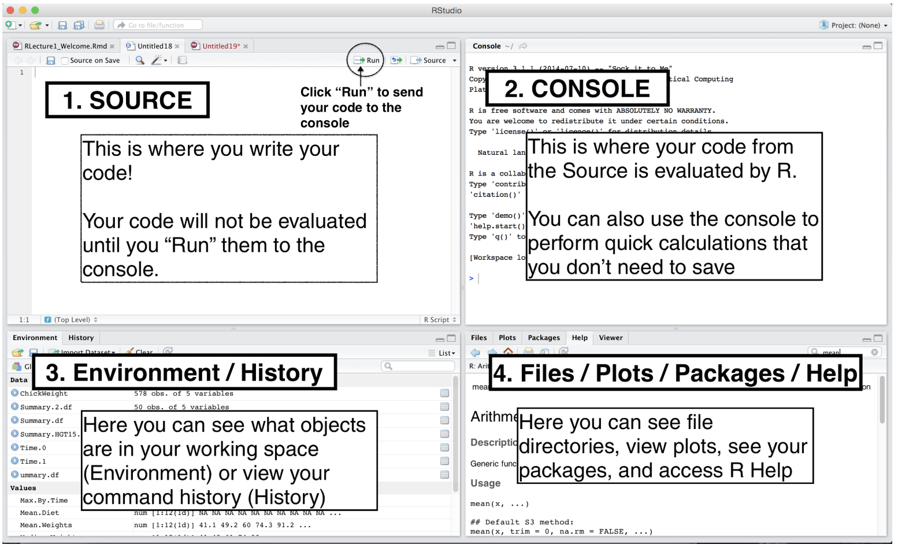

class: center
background-image: url(https://media.giphy.com/media/g6Xmo9j6U0IhO/giphy.gif) 
---

class: inverse, center
background-image: url(https://media.giphy.com/media/kMM3vtBEgSsLu/giphy.gif) 

# Welcome & 
 

---
# What is R Markdown?

--

- R Markdown is a file format for making dynamic documents with R;

--

- allows you to combine code, results, and prose commentary, and generate high quality documents;

--

- it's great for collaborating with other scientists (including future you!), who are interested in both your conclusions, and how you reached them ( i.e. the code);

--

- can be used as  "modern day lab notebook where you can capture not only what you did, but also what you were thinking". 

--

- R Markdown documents are fully reproducible and support lots of different output formats (such as pdf, html, and doc).


---
# What can R Markdown do?


--

    - Compile a single R Markdown document to a report in different formats;
--

    - Create notebooks in which you can directly run code chunks interactively;
--

    - Make slides for presentations (like this one);
--

    - Build interactive applications based on Shiny;
--

    - Write journal articles, books, and thesis;
--

    - Posters;
--
    
    - Websites and blogs.
    
---

class: inverse
background-image: url("https://media.giphy.com/media/yyvSeRGVj4C64/giphy.gif")


---


Our tutorial

This presentation

[(My personal example)](file:///Users/magaiarsa/Dropbox/Phd_Git/Multiple-drivers/Manuscript/ATese/reviews/2018/MultipleDriversWriteUp.html)

[(Analysis write-up for a paper)](file:///Users/magaiarsa/Dropbox/speciesRoles/writeUp/SpeciesRoles_writeUp.html)


---

# File structure

**Header**: The text at the top of the document, written in YAML format surrounded by

`---` .

--

**Markdown sections**: Text that describes your workflow written using markdown syntax.

--

**Code chunks**: Chunks of R code that can be run and also can be rendered using knitr to an output document.

---
## Compiling an R Markdown File
There are a couple ways to compile an R Markdown file:

1. Press the `Knit` button (!)
2. Keyboard shortcut: `Ctrl + Shift + K (Cmd + Shift + K on macOS)`
3. In your console type: `rmarkdown::render()`

Note, R Markdown files **ONLY** use datasets, packages, objects, parameters, etc. defined or included in the file (not those defined in the R session or R environment). 

---
# RStudio windows



---


# Header (YAML metadata)

YAML metadata is the information you provide to format and generate an R Markdown file.

The YAML metadata composes the first few lines of the R Markdown file, and includes the `title`, `author`, `date` and `output` type.

As a starting point, the YAML data of your document can be:
```
---
title: "R-Ladies Meeting"
author: "R-Ladies"
date: "2020"
output: word_document
---
```

---

You can also add more details and refine the layour a bit:
```
---
title: "Doing It All With R Markdown"
author: "Marília P. Gaiarsa"
date: "January 2020"
output: 
  html_document:
    toc: true
    toc_depth: 2
    toc_float: true
    number_sections: true
    theme: paper
    highlight: tango
---
```

---
# Output Formats 

There are two types of R Markdown output formats: documents and presentations. 

R Markdown can be used to generate the following formats:

* `html_document`
* `pdf_document`
* `word_document`
* `powerpoint_presentation`
* `beamer_presentation`
* `github_document`
* `latex_document`
* `ioslides_presentation`
* `md_document`
* `odt_document`
* `rtf_document`
* `slidy_presentation`
* `xaringan_presentation`


---

class: inverse


background-image: url("https://media.giphy.com/media/JIX9t2j0ZTN9S/giphy.gif")
background-position: right

# On to R Markdown!
