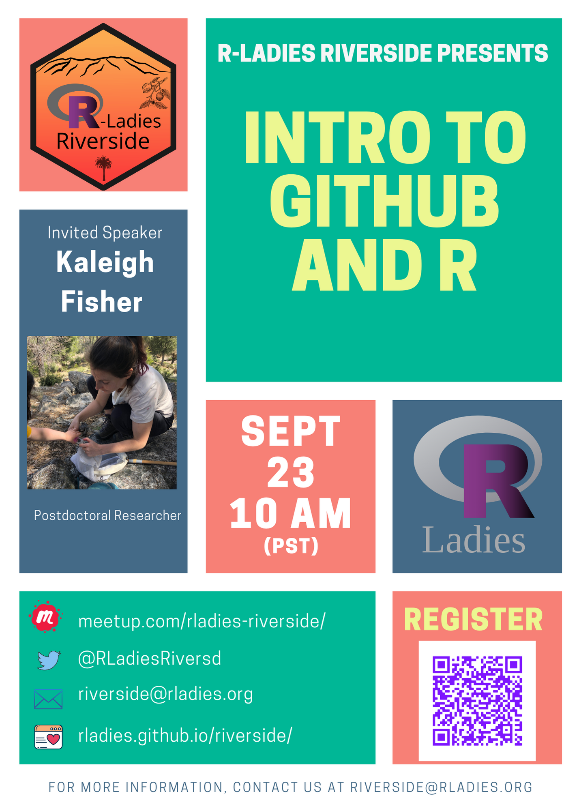
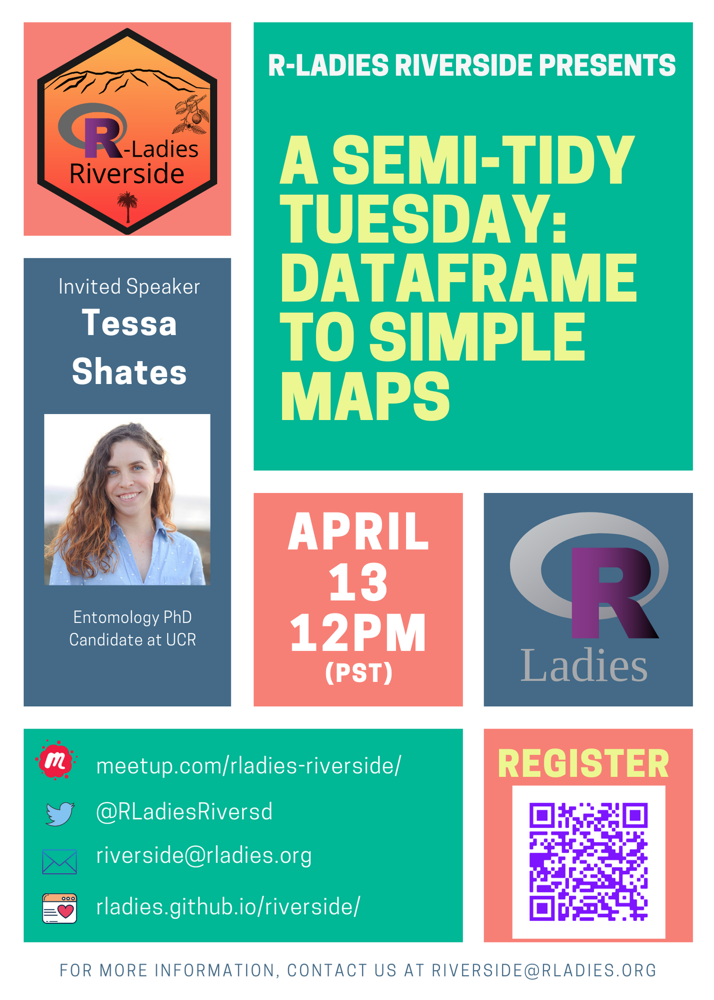
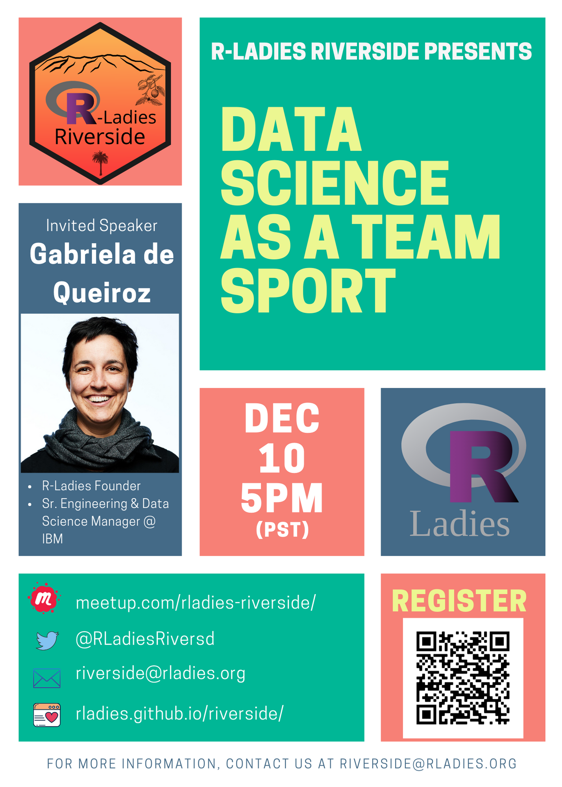
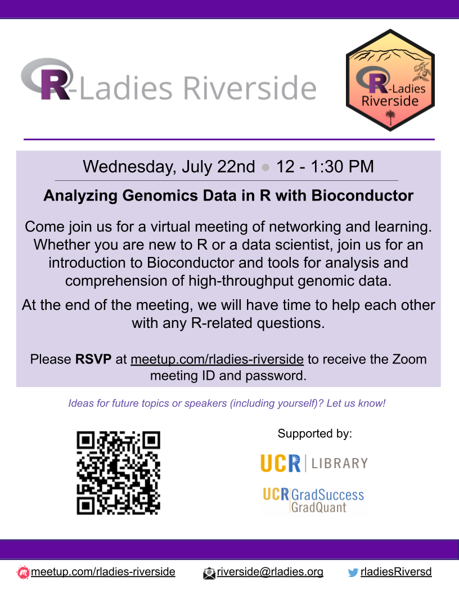
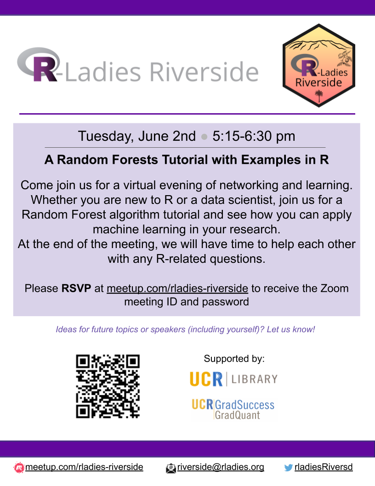
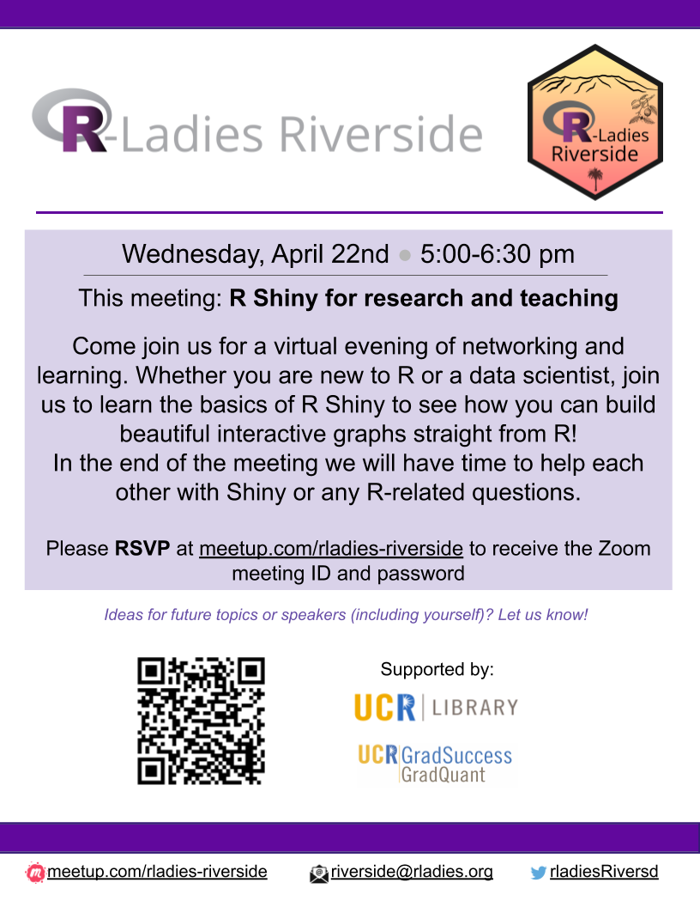
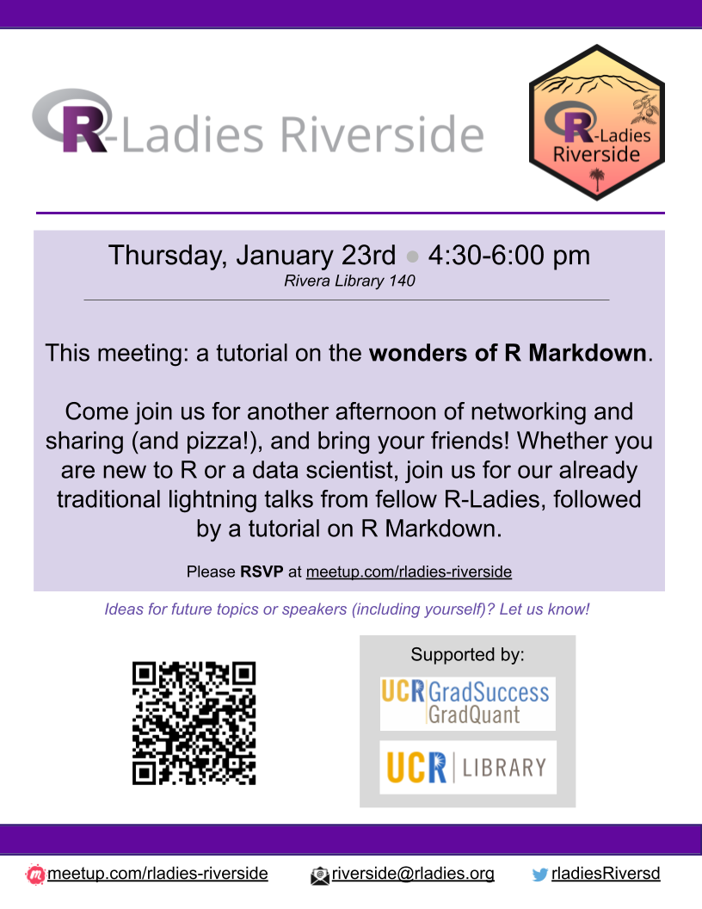
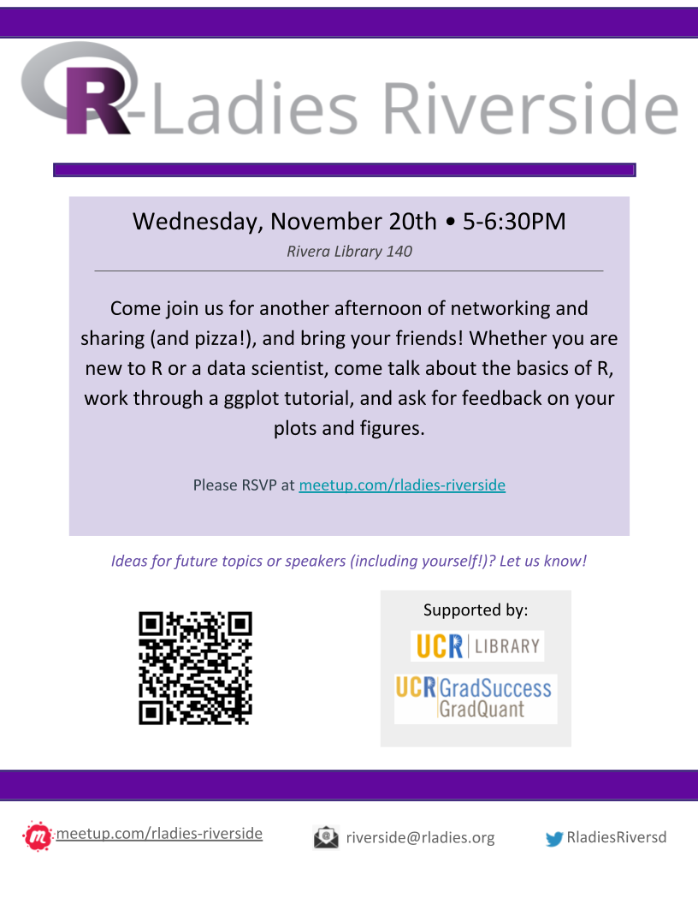
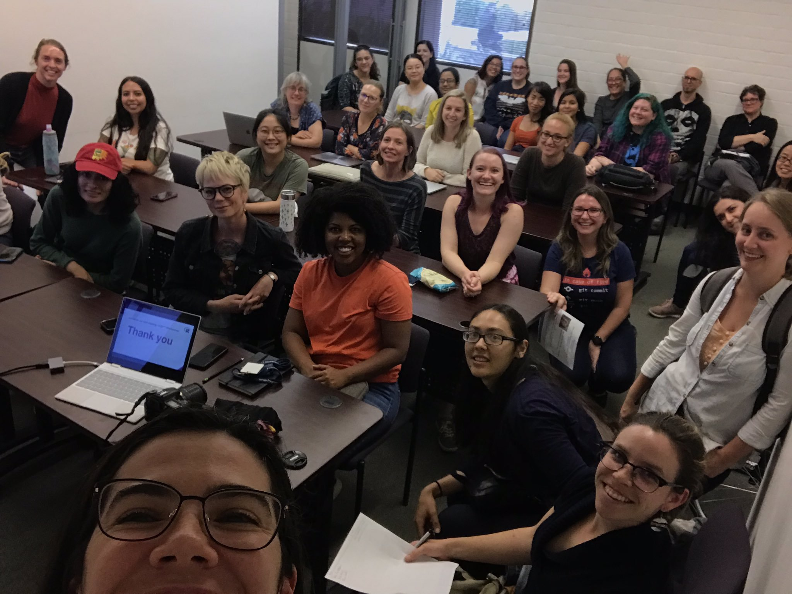

<!-- Main -->

<!-- Upcoming Events -->
<section id="one">
	

		<header class="major">
			<h2>Upcoming Events</h2>
		</header>
		

	

</section> 

<!-- Add here -->
<section id="two" class="spotlights">
	<section>
		
		

			

				<header class="major">
				<!-- Add Title here -->
					<h3>A Semi-Tidy Tuesday: Dataframe to simple maps</h3>
				</header>
				<!-- Add more details here -->
				
Hello RiveRside community ;-)

			
Join us for a virtual meeting of networking and learning next Thursday, September 23th, at 10:00 AM (PST). Don't forget to RSVP in our <a href="https://www.meetup.com/rladies-riverside/events/280747902/">Meetup</a> to get access to the meeting ID and password.

			
We will learn how to navigate between GitHub and R-studio. These tools
will be helpful for collaborative coding, version control, and developing reproducible workflows. Please make a GitHub account and download R-studio before the session.

			
At the end of the meeting, we will have time to help each other with any
R-related questions. Please have R and RStudio already installed on your computers.

			
Big thanks to UCR Library and UCR GradQuant for supporting us, and to
our guest speaker *Kaleigh Fisher* from the Department of Entomology at UCR!

				
See you soon!

				<ul class="actions">
					<li><a href="https://www.meetup.com/rladies-riverside/events/280747902/" class="button">Register here</a></li>
				</ul>
			

		

	</section>
</section>

<!-- Past Events -->
<section id="one">
	

		<header class="major">
			<h2>Past Events</h2>
		</header>
		

	

</section> 

<!-- Two -->
<section id="two" class="spotlights">

<!-- Past events -->
<!-- add here -->

<!-- Apr 2021 -->
	<section>
		
		

			

				<header class="major">
				<!-- Add Title here -->
					<h3>A Semi-Tidy Tuesday: Dataframe to simple maps</h3>
				</header>
				<!-- Add more details here -->
				
Hello RiveRside community ;-)

				
Come join us for a virtual meeting of networking and learning next Tuesday, April 13th, 12:00 PM (PST). Don't forget to RSVP in our Meetup to get access to the meeting's ID and password.

				
Whether you are new to R or a data scientist, join us for an introduction to Maps in R. We will introduce a variety of packages to use coordinates from a dataframe and create maps without GIS software.

				
At the end of the meeting, we will have time to help each other with any R-related questions.
				Don't forget to RSVP in our <a href="https://www.meetup.com/rladies-riverside/events/277326999/">Meetup</a> to get access to the meeting's ID and password.

						
Big thanks to UCR Library and UCR GradQuant for supporting us, and to our guest speaker *Tessa Shates* from the Department of Entomology at UCR!

				
See you soon!

				<ul class="actions">
					<li><a href="https://www.meetup.com/rladies-riverside/events/277326999/" class="button">Register here</a></li>
					<li><a href="https://github.com/rladies/riverside/blob/master/Presentations/2021_04_13/README.md" class="button">Slides and code here</a></li>
				</ul>
			

		

	</section>

<!-- Dec 2020 -->
	<section>
		
		

			

				<header class="major">
				<!-- Add Title here -->
					<h3>Data Science as a Team Sport</h3>
				</header>
				<!-- Add more details here -->
				
Hello RiveRside community ;-)

				
Join us for our next virtual meeting of learning and networking, Thursday, December 10th, at 5:00 PM (PST).

				
We will hear from <a href="https://k-roz.com/">Gabriela de Queiroz </a>, founder of <a href="https://rladies.org/">R-Ladies</a> and <a href="https://www.ai-inclusive.org/">AI Inclusive</a>. Gabriela will tell us about her career journey, as well as the many different roles a Data Scientist may have. 

				
At the end of the meeting, there will be time to ask any questions you may have about data scientist careers or questions about R in general.
				Don't forget to RSVP in our <a href="https://www.meetup.com/rladies-riverside/events/274066116/">Meetup</a> to get access to the meeting's ID and password.

						
Big thanks to UCR Library and UCR GradQuant for supporting us.

				
See you soon!

				<ul class="actions">
					<li><a href="https://www.meetup.com/rladies-riverside/events/274066116/" class="button">Register here</a></li>
				</ul>
			

		

	</section>

<!-- Jul 2020 -->
	<section>
		
		

			

				<header class="major">
				<!-- Add Title here -->
					<h3>Analyzing Genomics Data in R with Bioconductor</h3>
				</header>
				<!-- Add more details here -->
				
Hello RiveRside community ;-)

				
Come join us for a virtual meeting of networking and learning next Wednesday, July 22nd, 12:00 (PST). Don't forget to RSVP in our 
				<a href="https://www.meetup.com/rladies-riverside/events/271929066/"> Meetup page</a> page to get access to the meeting's ID and password.

				
Whether you are new to R or a data scientist, join us for an introduction to Bioconductor and tools for analysis and comprehension of high-throughput genomic data.

				
At the end of the meeting, we will have time to help each other with any R-related questions.

				
Big thanks to UCR Library and UCR GradQuant for supporting us, and to our guest speaker *Dr. Stephanie Hicks* from the Department of Biostatistics at Johns Hopkins Bloomberg School of Public Health!

				
				
<a href="https://github.com/rladies/riverside/tree/master/Presentations/2020_07_22">Slides and code for the meeting!</a> 

				
See you soon!

				<ul class="actions">
					<li><a href="https://www.meetup.com/rladies-riverside/events/271929066/" class="button">Register here</a></li>
				</ul>
			

		

	</section>

<!-- May 2020 -->
	<section>
		
		

			

				<header class="major">
				<!-- Add Title here -->
					<h3>A Random Forests Tutorial with Examples in R</h3>
				</header>
				<!-- Add more details here -->
				
Hello RiveRside community ;-)

				
Come join us for a virtual evening of networking and learning on Tuesday, June 2nd, 5:15 pm (PST). Please, don't forget to sign up on our
				<a href="https://www.meetup.com/rladies-riverside/events/270746911/"> Meetup page</a> page to get access to the meeting's ID and password.

				
Whether you are new to R or a data scientist, join us for a Random Forest algorithm tutorial and see how you can apply machine learning in your research. At the end of the meeting, we will have time to help each other with any R-related questions.

				
Please have R and RStudio already installed on your computers. Also please install and verify that the package is loaded and working properly by running the first three lines of code in the tutorial <a href="https://rladies.github.io/riverside/2020/05/20/packages.html">here</a>.

				
Big thanks to UCR Library and UCR GradQuant for supporting us, and to our guest speaker Rebecca Paulette Kurtz-Garcia from Statistics Department, UCR!

				
See you soon!

				<ul class="actions">
					<li><a href="https://www.meetup.com/rladies-riverside/events/270746911/" class="button">Register here</a></li>
				</ul>
			

		

	</section>

<!-- April 2020 -->
	<section>
		
		

			

				<header class="major">
					<h3>R Shiny for research and teaching</h3>
				</header>
				

				<ul class="actions">
					<li><a href="2020/04/22/2020apr.html" class="button">Learn more</a></li>
				</ul>
			

		

	</section>
	
<!-- fev 2020 -->
	<section>
		
		

			

				<header class="major">
					<h3>Tidy Tuesday</h3>
				</header>
				

				<ul class="actions">
					<li><a href="2020/02/25/2020feb.html" class="button">Learn more</a></li>
				</ul>
			

		

	</section>
	
<!-- jan 2020 -->
	<section>
		
		

			

				<header class="major">
					<h3>The wonders of R Markdown</h3>
				</header>
				

				<ul class="actions">
					<li><a href="2020/01/23/2020jan.html" class="button">Learn more</a></li>
				</ul>
			

		

	</section>
	
<!-- Nov 2019 -->
	<section>
		
		

			

				<header class="major">
					<h3>Come plot with us!</h3>
				</header>
				

				<ul class="actions">
					<li><a href="2019/11/20/2019nov.html" class="button">Learn more</a></li>
				</ul>
			

		

	</section>
	
<!-- Oct 2019 -->	
	<section>
		
		

			

				<header class="major">
					<h3>First Meeting</h3>
				</header>
				
Kickoff Meetup Meet & Greet

				<ul class="actions">
					<li><a href="2019/10/01/2019oct.html" class="button">Learn more</a></li>
				</ul>
			

		

	</section>
</section>

<!-- Three 
<section id="three">
	

		<header class="major">
			<h2>Massa libero</h2>
		</header>
		
Nullam et orci eu lorem consequat tincidunt vivamus et sagittis libero. Mauris aliquet magna magna sed nunc rhoncus pharetra. Pellentesque condimentum sem. In efficitur ligula tate urna. Maecenas laoreet massa vel lacinia pellentesque lorem ipsum dolor. Nullam et orci eu lorem consequat tincidunt. Vivamus et sagittis libero. Mauris aliquet magna magna sed nunc rhoncus amet pharetra et feugiat tempus.

		<ul class="actions">
			<li><a href="generic.html" class="button next">Get Started</a></li>
		</ul>
	

</section> -->

